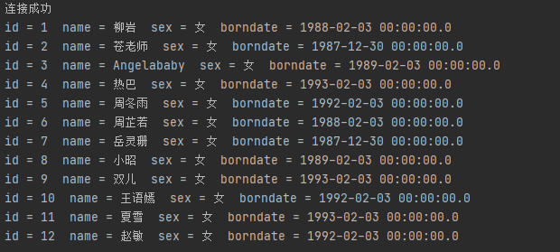

# JDBC

## Demo

```java
    public static void main(String[] args) throws ClassNotFoundException, SQLException {
        // 1 加载驱动
        Class.forName("com.mysql.jdbc.Driver");

        //2 用户信息 和 url
        String url = "jdbc:mysql://localhost:3306/girls?useUnicode=true&characterEncoding=utf8&useSSL=true";
        String username = "root";
        String password = "1234";
        
        // 3 连接成功 数据库对象 Connection 
        Connection connection = DriverManager.getConnection(url, username, password);
        System.out.println("连接成功");

        // 4 执行 sql 语句 对象 Statement
        Statement statement = connection.createStatement();

        // 5 执行 sql 对象 执行sql， 查看返回结果
        String sql = "SELECT * FROM beauty";

        ResultSet resultSet = statement.executeQuery(sql);

        while(resultSet.next()) {
            System.out.println("id = " + resultSet.getObject("id") + "  " +
                    "name = " + resultSet.getObject("name") + "  " +
                    "sex = " + resultSet.getObject("sex") + "  " +
                    "borndate = " + resultSet.getObject("borndate"));

    }

        // 6 释放连接
        resultSet.close();
        statement.close();
        connection.close();
    }
```



**步骤总结：**

**1 加载驱动**

**2 连接数据库 DriverManager**

**3 获得执行sql语句 Statement**

**4 获得返回的结果集** 

**5 释放连接**


> DriverManager    //加载驱动

```java
Class.forName("com.mysql.jdbc.Driver");   // 固定写法

Connection connection = DriverManager.getConnection(url, username, password);
// connection代表数据库
connection.commit();
connection.rollback();
connection.setAutoCommit();
```


> Statement  //执行sql语句  PrepareStatement

```java
statement.executeQuery();  // 执行查询sql
statement.execute();       // 执行任何sql
statement.executeUpdate(); // 执行更新， 删除， 插入， 返回受影响的行数
```


> ResultSet //查询的结果集：封装了所有的查询结果

```java
resultSet.getObject();
resultSet.getInt();
resultSet.getDate();
```


> 释放资源

```java
resultSet.close();
statement.close();
connection.close();
```


# 编写JdbcUtils

> JdbcUtils.class

```java
import java.io.IOException;
import java.io.InputStream;
import java.sql.*;
import java.util.Properties;

public class JdbcUtils {
    private  static String driver = null;
    private  static String url = null;
    private  static String username = null;
    private  static String password = null;


    static {
        try {
            InputStream inputStream = JdbcUtils.class.getClassLoader().getResourceAsStream("db.properties");
            Properties properties = new Properties();
            properties.load(inputStream);

            driver = properties.getProperty("driver");
            url = properties.getProperty("url");
            username = properties.getProperty("username");
            password = properties.getProperty("password");

            Class.forName(driver);

        } catch (IOException | ClassNotFoundException e) {
            e.printStackTrace();
        }
    }

    public static Connection getConnection() throws SQLException {
        Connection connection = DriverManager.getConnection(url, username, password);
        return  connection;
    }

    public static void release(Connection connection, Statement statement, ResultSet resultSet) {
        if(connection != null) {
            try {
                connection.close();
            } catch (SQLException e) {
                e.printStackTrace();
            }
        }

        if(statement != null) {
            try {
                statement.close();
            } catch (SQLException e) {
                e.printStackTrace();
            }
        }

        if(resultSet != null) {
            try {
                resultSet.close();
            } catch (SQLException e) {
                e.printStackTrace();
            }
        }
    }
}

```


> Test

测试 JdbcUtils编写是否正确

```java
import java.sql.Connection;
import java.sql.ResultSet;
import java.sql.SQLException;
import java.sql.Statement;


public class Test {
    public static void main(String[] args) throws SQLException {
        Connection connection = JdbcUtils.getConnection();

        Statement statement = connection.createStatement();

        // 5 执行 sql 对象 执行sql， 查看返回结果
        String sql = "SELECT * FROM beauty";

        ResultSet resultSet = statement.executeQuery(sql);

        while (resultSet.next()) {
            System.out.println("id = " + resultSet.getObject("id") + "  " +
                    "name = " + resultSet.getObject("name") + "  " +
                    "sex = " + resultSet.getObject("sex") + "  " +
                    "borndate = " + resultSet.getObject("borndate"));
        }
        JdbcUtils.release(connection, statement, resultSet);
    }
}
```


# Statement


> ## SQL 注入问题

SQL 存在漏洞，容易被攻击


# PreparedStatement

PreparedStatement 可以防止SQL注入

注意！！！

需要预编译

> TestInsert

```java
import java.sql.Connection;
import java.sql.PreparedStatement;
import java.sql.SQLException;
import java.text.ParseException;
import java.text.SimpleDateFormat;
import java.util.Date;

public class TestInsert {
    public static void main(String[] args) {
        Connection conn = null;
        PreparedStatement preparedStatement = null;

        try {
            conn = JdbcUtils.getConnection();

            // ? 占位符
            String sql = "INSERT INTO beauty (`name`, `sex`,`borndate`,`phone`,`photo`,`boyfriend_id`) VALUES (?, ?, ?, ?, ?, ?)";

            preparedStatement = conn.prepareStatement(sql);  // 预编译sql， 不执行

            // 手动赋值
            preparedStatement.setString(1, "xiao_yin");
            preparedStatement.setString(2, "女");

            SimpleDateFormat sdf = new SimpleDateFormat("yyyy-MM-dd HH:mm:ss");
            Date date = sdf.parse("1997-5-6 00:00:00");
            long lg = date.getTime();                               //日期转时间戳

            preparedStatement.setDate(3, new java.sql.Date(lg));
            preparedStatement.setString(4, "1111111");
            preparedStatement.setString(5, null);
            preparedStatement.setInt(6, 1);


            int i = preparedStatement.executeUpdate();
            if(i > 0) {
                System.out.println("插入成功");
            }

        } catch (SQLException | ParseException throwables) {
            throwables.printStackTrace();
        } finally {
            JdbcUtils.release(conn, preparedStatement, null);
        }
    }
}
```


> TestUpdate

```java
import java.sql.Connection;
import java.sql.PreparedStatement;
import java.sql.SQLException;
import java.text.ParseException;
import java.text.SimpleDateFormat;
import java.util.Date;

public class TestUpdate {
    public static void main(String[] args) {
        Connection conn = null;
        PreparedStatement preparedStatement = null;

        try {
            conn = JdbcUtils.getConnection();

            // ? 占位符
            String sql = "DELETE from beauty where beauty.name = ?";

            preparedStatement = conn.prepareStatement(sql);  // 预编译sql， 不执行

            // 手动赋值
            preparedStatement.setString(1, "xiao_yin");

            int i = preparedStatement.executeUpdate();
            if(i > 0) {
                System.out.println("删除成功");
            }

        } catch (SQLException throwables) {
            throwables.printStackTrace();
        } finally {
            JdbcUtils.release(conn, preparedStatement, null);
        }
    }
}
```


> TestSelect

```java
import java.sql.Connection;
import java.sql.PreparedStatement;
import java.sql.ResultSet;
import java.sql.SQLException;

public class TestSelect {
    public static void main(String[] args) {
        Connection conn = null;
        PreparedStatement preparedStatement = null;
        ResultSet resultSet = null;

        try {
            conn = JdbcUtils.getConnection();

            // ? 占位符
            String sql = "select * from beauty where name = ?";

            preparedStatement = conn.prepareStatement(sql);  // 预编译sql， 不执行

            // 手动赋值
            preparedStatement.setString(1, "赵敏");

            resultSet = preparedStatement.executeQuery();

            while(resultSet.next()) {
                System.out.println("id = " + resultSet.getObject("id") + "  " +
                        "name = " + resultSet.getObject("name") + "  " +
                        "sex = " + resultSet.getObject("sex") + "  " +
                        "borndate = " + resultSet.getObject("borndate"));
            }

        } catch (SQLException throwables) {
            throwables.printStackTrace();
        } finally {
            JdbcUtils.release(conn, preparedStatement, resultSet);
        }
    }
}
```


# 事务

> ACID原则

原子性 ：要么全部完成， 要么都不完成

一致性： 总数不变

**隔离性： 多个进程互不干扰**

持久性： 一旦提交，持久化到数据库


隔离性的问题：

脏读： 一个事务读取了另一个没有提交的事务

不可重复读： 在同一个事务中，重复读取表中的数据，表数据发生了改变

虚读（幻读）： 在一个事务内， 读取到了别人插入的数据，导致前后读出的结果不一致


> TestTrascation1

```java
import java.sql.Connection;
import java.sql.PreparedStatement;
import java.sql.ResultSet;
import java.sql.SQLException;

public class TestTransaction1 {
    public static void main(String[] args) {
        Connection connection = null;
        PreparedStatement preparedStatement = null;
        ResultSet resultSet = null;

        try {
            connection = JdbcUtils.getConnection();

            // 关闭自动提交， 开启事务
            connection.setAutoCommit(false);

            String sql1 = "UPDATE account set money = money - 100 where name = 'A'";
            preparedStatement = connection.prepareStatement(sql1);
            preparedStatement.executeUpdate();

            String sql2 = "UPDATE account set money = money + 100 where name = 'B'";
            preparedStatement = connection.prepareStatement(sql2);
            preparedStatement.executeUpdate();

            // 业务完毕 提交事务
            connection.commit();
            System.out.println("操作成功");

        } catch (SQLException e) {
            try {
                // 失败回滚
                connection.rollback();
            } catch (SQLException e1) {
                e1.printStackTrace();
            }
            e.printStackTrace();
        } finally {
            JdbcUtils.release(connection, preparedStatement, resultSet);
        }
    }
}

```


操作失败， 回滚

```java
import java.sql.Connection;
import java.sql.PreparedStatement;
import java.sql.ResultSet;
import java.sql.SQLException;

public class TestTransaction1 {
    public static void main(String[] args) {
        Connection connection = null;
        PreparedStatement preparedStatement = null;
        ResultSet resultSet = null;

        try {
            connection = JdbcUtils.getConnection();

            // 关闭自动提交， 开启事务
            connection.setAutoCommit(false);

            String sql1 = "UPDATE account set money = money - 100 where name = 'A'";
            preparedStatement = connection.prepareStatement(sql1);
            preparedStatement.executeUpdate();

            int i = 1 / 0;       //  !!!!!

            String sql2 = "UPDATE account set money = money + 100 where name = 'B'";
            preparedStatement = connection.prepareStatement(sql2);
            preparedStatement.executeUpdate();

            // 业务完毕 提交事务
            connection.commit();
            System.out.println("操作成功");

            //失败默认回滚
        } catch (SQLException e) {
            try {
                // 失败回滚
                connection.rollback();
            } catch (SQLException e1) {
                e1.printStackTrace();
            }
            e.printStackTrace();
        } finally {
            JdbcUtils.release(connection, preparedStatement, resultSet);
        }
    }
}
```

> 步骤

1 开启事务

2 一组事务执行完毕，提交事务

3 可以在catch语句中 显式 定义 回滚语句， 但是默认失败就回滚。


# 数据库连接池

数据库连接 -- 执行完毕 -- 释放资源

十分浪费资源


**池化技术： 准备一些预先的资源，过来就连接预先连接好的**


最小连接数 10

最大连接数 100     业务最高承载上限

等待超时 100ms


**编写连接池，实现一个接口 DataSource**


> ## 开源数据源

DBCP

C3P0

Druid： Alibaba

--------------------

使用了这些数据库连接池后，在项目开发中就不需要编写数据库连接池了！！！

 

> ### DBCP

编写dbcpconfig.properties

```properties
driverClassName = com.mysql.jdbc.Driver
url = jdbc:mysql://localhost:3306/girls?useUnicode=true&characterEncoding=utf8&useSSL=true
username = root
password = 1234

#<!-- 初始化连接 -->
initialSize = 10

# 最大连接数量
maxActive = 50

#<!-- 最大空闲连接 -->
maxIdle = 5

#超时等待时间 毫秒单位
maxWait = 60000
```


使用jar包

commons-dbcp-1.4 

commons-pool-1.6

---


**JdbcUtils_DBCP**

```java
import org.apache.commons.dbcp.BasicDataSourceFactory;

import javax.sql.DataSource;
import java.io.IOException;
import java.io.InputStream;
import java.sql.*;
import java.util.Properties;


public class JdbcUtils_DBCP {

        private static DataSource dataSource = null;

    static {
        try {
            InputStream inputStream = JdbcUtils_DBCP.class.getClassLoader().getResourceAsStream("dbcpconfig.properties");
            Properties properties = new Properties();
            properties.load(inputStream);

            // 创建数据源 工厂模式 --> 创建对象
            dataSource = BasicDataSourceFactory.createDataSource(properties);


        } catch (Exception e) {
            e.printStackTrace();
        }
    }

    public static Connection getConnection() throws SQLException {
        return dataSource.getConnection();        // 从数据源中获取连接
    }

    public static void release(Connection connection, Statement statement, ResultSet resultSet) {
        if(connection != null) {
            try {
                connection.close();
            } catch (SQLException e) {
                e.printStackTrace();
            }
        }

        if(statement != null) {
            try {
                statement.close();
            } catch (SQLException e) {
                e.printStackTrace();
            }
        }

        if(resultSet != null) {
            try {
                resultSet.close();
            } catch (SQLException e) {
                e.printStackTrace();
            }
        }
    }
}
```

 **TestDBCP**

```java
import com.zpc.lesson5.utils.JdbcUtils_DBCP;

import java.sql.*;

public class TestDBCP {
    public static void main(String[] args) throws SQLException {
        // 使用连接池连接
        Connection connection = JdbcUtils_DBCP.getConnection();

        String sql = "SELECT * FROM beauty";

        PreparedStatement preparedStatement = connection.prepareStatement(sql);

        ResultSet resultSet = preparedStatement.executeQuery();

        while (resultSet.next()) {
            System.out.println("id = " + resultSet.getObject("id") + "  " +
                    "name = " + resultSet.getObject("name") + "  " +
                    "sex = " + resultSet.getObject("sex") + "  " +
                    "borndate = " + resultSet.getObject("borndate"));
        }
        JdbcUtils_DBCP.release(connection, preparedStatement, resultSet);
    }
}
```

***


> ## C3P0

jar包

c3p0-0.9.1.2.jar， mchange-commons-java-0.2.19.jar

***


> **结论**
>
> 无论使用什么连接池， 都是为了 获得 dataSource， 然后通过dataSource.getConnection() 获取数据库连接。

