# Mybatis

环境：

- jdk1.8
- Mysql 5.7
- maven 3.6.1

回顾

- JDBC
- Mysql
- java基础
- Maven
- Junit


框架： 配置文件，看官网

<http://www.mybatis.org/mybatis-3/zh/index.html>


# 1、简介

## 1.1 什么是Mybatis


- MyBatis 是一款优秀的**持久层框架**
- 它支持自定义 SQL、存储过程以及高级映射。MyBatis 免除了几乎所有的 JDBC 代码以及设置参数和获取结果集的工作。
- MyBatis 可以通过简单的 XML 或注解来配置和映射原始类型、接口和 Java POJO（Plain Old Java Objects，普通老式 Java 对象）为数据库中的记录


如何获得Mybatis？

github  <https://github.com/mybatis/mybatis-3/releases>

maven

```xml
<dependency>
  <groupId>org.mybatis</groupId>
  <artifactId>mybatis</artifactId>
  <version>x.x.x</version>
</dependency>
```


## **1.2 持久化**

数据持久化

- 持久化就是将程序数据在持久状态和瞬时状态转换的过程
- 内存： **断电即失**
- 数据库（jdbc），io文件持久化


## 1.3 持久层

- 完成持久化的操作的代码块
- 层界限十分明显


## 1.4 为什么需要Mybatis

- 方便
- 传统的JDBC太复杂， 简化， 框架
- 方便将数据存入数据库
- 不用Mybatis也可以，更容易上手。
- 优点：

> 简单易学：
>
> 灵活
>
> sql和代码的分离，提高了可维护性。
>
> 提供映射标签，支持对象与数据库的orm字段关系映射
>
> 提供对象关系映射标签，支持对象关系组建维护
>
> 提供xml标签，支持编写动态sql

Spring --> SpringMVC --> Springboot


# 2、第一个Mybatis程序

思路： 搭建环境 --> 导入Mybatis --> 测试


## 2.1新建项目

1.新建一个Maven项目

2.删除src

3.导入maven依赖

```xml
<!-- 导入依赖 -->
    <dependencies>
        <!-- Mysql驱动 -->
        <dependency>
            <groupId>mysql</groupId>
            <artifactId>mysql-connector-java</artifactId>
            <version>5.1.47</version>
        </dependency>
        <!-- Mybatis -->
        <dependency>
            <groupId>org.mybatis</groupId>
            <artifactId>mybatis</artifactId>
            <version>3.5.5</version>
        </dependency>
        <!-- junit -->
        <dependency>
            <groupId>junit</groupId>
            <artifactId>junit</artifactId>
            <version>4.12</version>
            <scope>test</scope>
        </dependency>
    </dependencies>
```


## 2.2 创建一个模块

创建Maven module， 可以继承 父项目 导入的包


- 编写Mybatis的核心配置文件

  src/resources/ 目录下    

  mybatis-config.xml

```xml
<?xml version="1.0" encoding="UTF-8" ?>
<!DOCTYPE configuration
        PUBLIC "-//mybatis.org//DTD Config 3.0//EN"
        "http://mybatis.org/dtd/mybatis-3-config.dtd">
<configuration>
    <environments default="development">
        <environment id="development">
            <transactionManager type="JDBC"/>
            <dataSource type="POOLED">
                <property name="driver" value="com.mysql.jdbc.driver"/>
                <property name="url" value="jdbc:mysql://localhost:3306/girls?useSSL=true&amp;useUnicode=true&amp;characterEncoding=UTF-8"/>
                <property name="username" value="root"/>
                <property name="password" value="1234"/>
            </dataSource>
        </environment>
    </environments>
    <mappers>
        <mapper resource="org/mybatis/example/BlogMapper.xml"/>
    </mappers>
</configuration>
```


- 编写Mybatis工具类

```java
import org.apache.ibatis.io.Resources;
import org.apache.ibatis.session.SqlSession;
import org.apache.ibatis.session.SqlSessionFactory;
import org.apache.ibatis.session.SqlSessionFactoryBuilder;

import java.io.IOException;
import java.io.InputStream;

// SqlSessionFactory --> SqlSession
public class MybatisUtils {
    private static SqlSessionFactory sqlSessionFactory = null;
    static  {

        try {
            // 第一步 获取SqlSessionFactory对象
            String resource = "mybatis-config.xml";
            InputStream inputStream = Resources.getResourceAsStream(resource);
            SqlSessionFactory sqlSessionFactory = new SqlSessionFactoryBuilder().build(inputStream);
        } catch (IOException e) {
            e.printStackTrace();
        }
    }

    public static SqlSession getSqlSession() {
        SqlSession sqlSession = sqlSessionFactory.openSession();
        return sqlSession;
    }
}
```


## 2.3 编写代码

- 实体类

  pojo / Beauty.java

  ```java
  // 实体类
  public class Beauty {
      private int id;
      private String name;
      private String sex;
      private int boyfriend_id;
  
      public Beauty() {
  
      }
  
      public Beauty(int id, String name, String sex, int boyfriend_id) {
          this.id = id;
          this.name = name;
          this.sex = sex;
          this.boyfriend_id = boyfriend_id;
      }
  
      public int getId() {
          return id;
      }
  
      public String getName() {
          return name;
      }
  
      public String getSex() {
          return sex;
      }
  
      public int getBoyfriend_id() {
          return boyfriend_id;
      }
  
      public void setId(int id) {
          this.id = id;
      }
  
      public void setName(String name) {
          this.name = name;
      }
  
      public void setSex(String sex) {
          this.sex = sex;
      }
  
      public void setBoyfriend_id(int boyfriend_id) {
          this.boyfriend_id = boyfriend_id;
      }
  }
  ```

  

- dao接口

  dao/UserDao.java

  ```java
  import java.util.List;
  
  public interface UserDao {
      List<Beauty> getBeautyList();
  }
  ```

- 接口实现类

  一个mapper xml文件

  dao/BeautyMapper.xml

  ```xml
  <?xml version="1.0" encoding="UTF-8" ?>
  <!DOCTYPE mapper
          PUBLIC "-//mybatis.org//DTD Mapper 3.0//EN"
          "http://mybatis.org/dtd/mybatis-3-mapper.dtd">
  <!-- namespace 绑定一个 dao/mapper 接口-->
  <mapper namespace="com.zpc.dao.UserDao">
      <select id="getBeautyList" resultType="com.zpc.pojo.Beauty">
          select * from girls.beauty
      </select>
  </mapper>
  ```

  

## 2.4 测试

- junit测试

  ```java
  import com.zpc.pojo.Beauty;
  import com.zpc.utils.MybatisUtils;
  import org.apache.ibatis.session.SqlSession;
  import org.junit.Test;
  
  import java.util.List;
  
  public class UserDaoTest {
  
      @Test
      public void test() {
          // 1 获取 SqlSession 对象
          SqlSession sqlSession = MybatisUtils.getSqlSession();
  
          // 执行sql 方式一  getMapper
          UserDao userDao = sqlSession.getMapper(UserDao.class);
          List<Beauty> beautyList = userDao.getBeautyList();
  
          for (Beauty beauty: beautyList) {
              System.out.println(beauty.getName());
          }
          // 关闭 sqlSession
          sqlSession.close();
      }
  }
  ```

  特别需要注意的地方 pom.xml 加入 编译resource

  ```xml
  <build>
      <resources>
          <resource>
              <directory>src/main/java</directory>
              <includes>
                  <include>**/*.properties</include>
                  <include>**/*.xml</include>
              </includes>
              <filtering>false</filtering>
          </resource>
          <resource>
              <directory>src/main/resources</directory>
              <includes>
                  <include>**/*.properties</include>
                  <include>**/*.xml</include>
              </includes>
              <filtering>false</filtering>
          </resource>
      </resources>
  </build>
  ```


​	最后目录结构：

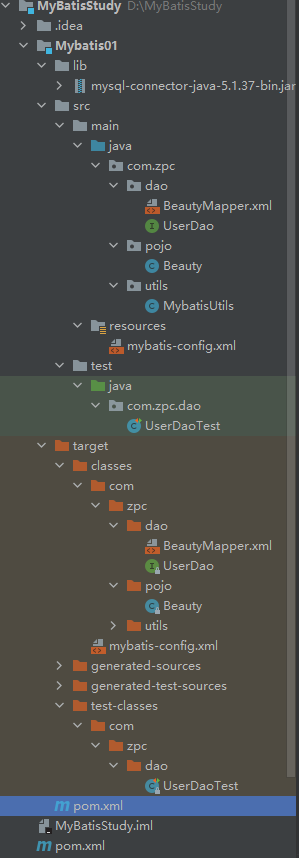

 	可能会遇到的问题：

1. ​		配置文件没有注册
2. ​		绑定接口错误
3. ​		方法名不对
4. ​		返回类型不对
5. ​		Maven到处资源不对


# 3、CRUD

## 1、namespace

namespace 中的包名要和接口的包名 一致


## 2、select

```xml
<mapper namespace="com.zpc.dao.UserDao">
    <select id="getBeautyList" resultType="com.zpc.pojo.Beauty">
        select * from beauty
    </select>
</mapper>
```


选择，查询

- id： 就是对应namespace中的方法名

- resultType:  sql语句的返回值！

- parameterType：参数类型 (上面的Userdao 全改成 BeautyMapper)

  ```xml
  <select id="getBeautyById" parameterType="int" resultType="com.zpc.pojo.Beauty">
      select * from beauty where id = #{id};
  </select>
  ```

  1 编写接口 （BeautyMapper）

  2 编写对应的Mapper中的sql语句 （BeautyMapper.xml）

  3 测试

## 3、insert

**增删改 需要提交事务**

```xml
<insert id="addBeauty" parameterType="com.zpc.pojo.Beauty">
    insert into beauty (id,name,sex,boyfriend_id)
    values (#{id}, #{name}, #{sex}, #{boyfriend_id});
</insert>
```

```java
@Test
public void addBeauty() {
    // 增删改 需要提交事务
    Beauty beauty = new Beauty(13, "范冰冰", "女", 9);

    SqlSession sqlSession = MybatisUtils.getSqlSession();

    try {
        BeautyMapper mapper = sqlSession.getMapper(BeautyMapper.class);
        int res = mapper.addBeauty(beauty);
        if (res > 0) {
            System.out.println("已添加 " + beauty);
        }

        // 提交事务
        sqlSession.commit();
    } finally {
        sqlSession.close();
    }
}
```


## 4、update

```xml
<update id="updateBeauty" parameterType="Beauty">
    update beauty
    set name = #{name}, boyfriend_id = #{boyfriend_id}
    where id = #{id};
</update>
```


```java
@Test
public void updateBeauty() {
    Beauty beauty = new Beauty(13, "赵薇", "女", 10);

    SqlSession sqlSession = MybatisUtils.getSqlSession();

    try {
        BeautyMapper mapper = sqlSession.getMapper(BeautyMapper.class);
        int res = mapper.updateBeauty(beauty);
        if (res > 0) {
            System.out.println("已修改");
        }
        sqlSession.commit();
    } finally {
        sqlSession.close();
    }
}
```


## 5、delete

```xml
<delete id="deleteBeauty" parameterType="int">
    delete from beauty where id = #{id};
</delete>
```

```java
@Test
public void deleteBeauty() {
    SqlSession sqlSession = MybatisUtils.getSqlSession();

    try {
        BeautyMapper mapper = sqlSession.getMapper(BeautyMapper.class);
        int res = mapper.deleteBeauty(13);
        if (res > 0) {
            System.out.println("删除成功");
        }

        sqlSession.commit();
    } finally {
        sqlSession.close();
    }
}
```


## 6、万能的Map

假如，实体类或者数据库的表，字段或者参数太多，可以考虑使用Map

BeautyMapper.java

```java
int addBeauty2(Map<String, Object> map);
```


BeautyMapper.xml

```xml
<insert id="addBeauty2" parameterType="map">
    insert into beauty (id, name, sex, boyfriend_id) values (#{beauty_id}, #{beauty_name}, #{beauty_sex}, #{beauty_boyfriend_id})
</insert>
```


UserdaoTest.java

```java
@Test
public void addBeauty2() {
    SqlSession sqlSession = MybatisUtils.getSqlSession();

    try {
        BeautyMapper mapper = sqlSession.getMapper(BeautyMapper.class);
        Map<String, Object> map = new HashMap<>();

        map.put("beauty_id", 13);
        map.put("beauty_name", "赵薇");
        map.put("beauty_sex", "女");
        map.put("beauty_boyfriend_id", "9");

        int res = mapper.addBeauty2(map);
        sqlSession.commit();
        if (res > 0) {
            System.out.println("插入成功");
        }
    } finally {
        sqlSession.close();
    }
}
```


map传递参数，直接在sql中取出key即可    parameterType="map"

对象传递参数，直接在sql中取对象的属性   parameterType="com.zpc.pojo.Beauty"

只有一个参数的时候，可以直接从sql中取到    Beauty getBeautyById(int id);

多个参数使用Map， 或者**注解**


## 7、模糊查询

BeautyMapper.java

```java
// 模糊查询
List<Beauty> getBeautyByLike(String value);
```


BeautyMapper.xml

```xml
<select id="getBeautyByLike" resultType="com.zpc.pojo.Beauty">
    select * from Beauty where name like #{value};
</select>
```


**传递参数的时候，需要传递通配符 %**

UserDaoTest.java

```java
@Test
public void getBeautyByLike() {
    SqlSession sqlSession = MybatisUtils.getSqlSession();

    try {
        BeautyMapper mapper = sqlSession.getMapper(BeautyMapper.class);
        List<Beauty> beautyList = mapper.getBeautyByLike("%A%");

        for (Beauty beauty : beautyList) {
            System.out.println(beauty);
        }
    }finally {
        sqlSession.close();
    }
}
```


# 4、配置解析

## 1、核心配置文件

- mybatis-config.xml

- MyBatis 的配置文件包含了会深深影响 MyBatis 行为的设置和属性信息

  ```xml
  properties（属性）
  settings（设置）
  typeAliases（类型别名）
  typeHandlers（类型处理器）
  objectFactory（对象工厂）
  plugins（插件）
  environments（环境配置）
  environment（环境变量）
  transactionManager（事务管理器）
  dataSource（数据源）
  databaseIdProvider（数据库厂商标识）
  mappers（映射器）
  ```

  

## 2、环境配置（environments）

MyBatis 可以配置成适应多种环境

**不过要记住：尽管可以配置多个环境，但每个 SqlSessionFactory 实例只能选择一种环境。**

学会使用配置多套运行环境！（修改 <environment id = ?>  ）


Mybatis 默认的事务管理器是 JDBC， 连接池： POOLED


## 3、属性（properties）

可以通过properties属性来实现引用配置


编写配置文件

```properties
driver = com.mysql.jdbc.Driver
url = jdbc:mysql://localhost:3306/girls?useSSL=false;useUnicode=true;characterEncoding=UTF-8
username = root
password = 1234
```

在核心配置文件中引入

```xml
<?xml version="1.0" encoding="UTF-8" ?>
<!DOCTYPE configuration
        PUBLIC "-//mybatis.org//DTD Config 3.0//EN"
        "http://mybatis.org/dtd/mybatis-3-config.dtd">
<configuration>

    <properties resource="db.properties"/>
    <environments default="development">
        <environment id="development">
            <transactionManager type="JDBC"/>
            <dataSource type="POOLED">
                <property name="driver" value="${driver}"/>
                <property name="url" value="${url}"/>
                <property name="username" value="${username}"/>
                <property name="password" value="${password}"/>
            </dataSource>
        </environment>
    </environments>
    <mappers>
        <mapper resource="com/zpc/dao/BeautyMapper.xml"/>
    </mappers>
</configuration>
```

也可以在<properties></properties>中自己加入配置


## 4、类型别名（typeAliases）

- 类型别名可为 Java 类型设置一个缩写名字
- 意在降低冗余的全限定类名书写

mybatis-config.xml

```xml
<typeAliases>
    <typeAlias type="com.zpc.pojo.Beauty" alias="Beauty" />
</typeAliases>
```


BeautyMapper.xml

```xml
<select id="getBeautyList" resultType="Beauty">
    select * from beauty
</select>
```


也可以指定一个包名，MyBatis 会在包名下面搜索需要的 Java Bean

扫描实体类的包，他的默认别名就是这个类的类名，首字母小写（大小写均可）

也可用注解，见官网

```xml
<typeAliases>
    <package name="com.zpc.pojo"/>
</typeAliases>
```


实体类少用第一种

实体类多用第二种


## 5、设置（settings）

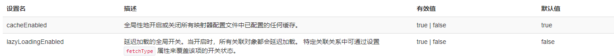


## 6、映射器（mappers）

MapperRegistry：注册绑定 Mapper文件

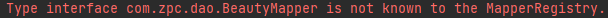

方式一： 【推荐使用】

```xml
    <mappers>
        <mapper resource="com/zpc/dao/BeautyMapper.xml"/>
    </mappers>
```

方式二 使用class文件：

```xml
<mappers>
    <mapper class="com.zpc.dao.BeautyMapper"/>
</mappers>
```

注意点：

- 接口和Mapper文件必须同名
- 接口和Mapper必须在同一个包下


## 7、作用域（Scope）和生命周期

理解我们之前讨论过的不同作用域和生命周期类别是至关重要的，因为错误的使用会导致非常严重的**并发**问题

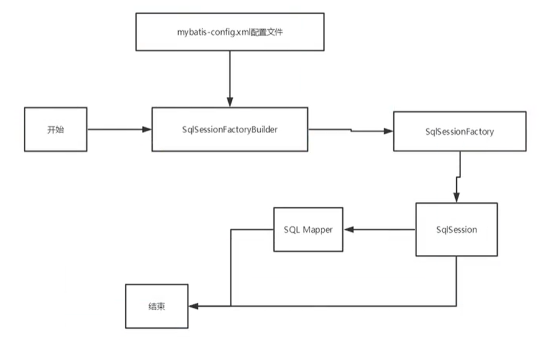

每个mapper是个业务

**SqlSessionFactoryBuilder：**

- 一旦创建了 SqlSessionFactory，就不再需要它了

- 适合局部变量


**SqlSessionFactory**

- 可以想象成数据库连接池，一旦被创建就应该在应用的运行期间一直存在，没有任何理由丢弃它或重新创建另一个实例

- 最简单的就是使用单例模式或者静态单例模式


**SqlSession：**

- 连接到连接池的一个请求
- SqlSession 的实例不是线程安全的，因此是不能被共享的，所以它的最佳的作用域是请求或方法作用域
- 用完后需要关闭，否则资源被占用


# 5、解决属性名和字段名不一致的问题

数据库的字段 是 boyfriend_id

而pojo里面设置为 boyfriend


test出现问题


（原boyfriend_id = 8）


解决方法：

- 取别名  select id, sex, name, boyfriend_id as boyfriend from Beauty where id = #{id}


## resultMap

结果集映射

```xml
id  name  sex  boyfriend_id
id  name  sex  boyfriend
```


```xml
<!-- 结果集映射-->
<resultMap id="BeautyMap" type="Beauty">
    <result column="id" property="id" />
    <result column="name" property="name" />
    <result column="sex" property="sex" />
    <result column="boyfriend_id" property="boyfriend" />
</resultMap>

<!--!!!-->
<select id="getBeautyById" resultMap="BeautyMap">
    select * from beauty where id = #{id};
</select>
```

`resultMap` 元素是 MyBatis 中最重要最强大的元素

resultMap的设计思想是，对于简单的语句根本不需要显式地配置结果映射，而对于复杂一点的语句只需要描述他们的关系就可以了。


# 6、日志

## 6.1 日志工厂

如果一个数据库操作，出现了异常，我们需要拍错，日志就是最好的助手！

曾经：sout、debug

现在：日志工厂！


- SLF4J 
-  LOG4J 【掌握】
- STDOUT_LOGGING 【掌握】


在Mybatis中具体使用哪个日志实现，在设置中设定！


**STDOUT_LOGGING 标准日志输出**

标准日志工厂实现

在Mybatis-config.xml 中配置

```xml
<settings>
    <setting name="logImpl" value="STDOUT_LOGGING"/>
</settings>
```


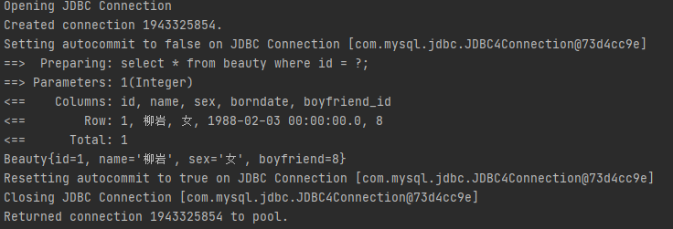


## 6.2 Log4j

什么是Log4j

- Log4j是[Apache](https://baike.baidu.com/item/Apache/8512995)的一个开源项目，通过使用Log4j，我们可以控制日志信息输送的目的地是[控制台](https://baike.baidu.com/item/控制台/2438626)、文件、[GUI](https://baike.baidu.com/item/GUI)组件
- 我们也可以控制每一条日志的输出格式
- 通过定义每一条日志信息的级别，我们能够更加细致地控制日志的生成过程
- 些可以通过一个[配置文件](https://baike.baidu.com/item/配置文件/286550)来灵活地进行配置，而不需要修改应用的代码

1. 先导入log4j的包

```xml
<dependency>
    <groupId>log4j</groupId>
    <artifactId>log4j</artifactId>
    <version>1.2.17</version>
</dependency>
```


2. log4j.properties

```properties
#将等级为DEBUG的日志信息输出到console和file这两个目的地，console和file的定义在下面的代码
log4j.rootLogger=DEBUG,console,file

#控制台输出的相关设置
log4j.appender.console = org.apache.log4j.ConsoleAppender
log4j.appender.console.Target = System.out
log4j.appender.console.Threshold=DEBUG
log4j.appender.console.layout = org.apache.log4j.PatternLayout
log4j.appender.console.layout.ConversionPattern=【%c】-%m%n

#文件输出的相关设置
log4j.appender.file = org.apache.log4j.RollingFileAppender
log4j.appender.file.File=./log/zpc.log
log4j.appender.file.MaxFileSize=10mb
log4j.appender.file.Threshold=DEBUG
log4j.appender.file.layout=org.apache.log4j.PatternLayout
log4j.appender.file.layout.ConversionPattern=【%p】【%d{yy-MM-dd}】【%c】%m%n

#日志输出级别
log4j.logger.org.mybatis=DEBUG
log4j.logger.java.sql=DEBUG
log4j.logger.java.sql.Statement=DEBUG
log4j.logger.java.sql.ResultSet=DEBUG
log4j.logger.java.sql.PreparedStatement=DEBUG
```


3. 配置log4j为日志的实现

   ```xml
   <settings>
       <!--        <setting name="logImpl" value="STDOUT_LOGGING"/>-->
       <setting name="logImpl" value="LOG4J"/>
   </settings>
   ```


4. log4j的使用，运行Userdao.java

   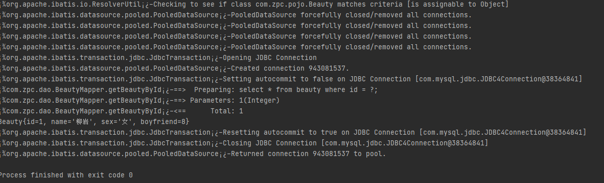

**简单使用**

1. 在使用Log4j的类中，导入包 org.apache.log4j.Logger

2. 日志对象，参数为当前类的class

   ```java
   static Logger logger = Logger.getLogger("UserDao.class");
   ```

3. 日志级别

   ```java
   logger.info("info: 进入了 testLog4j");
   logger.debug("debug: 进入了 testLog4j");
   logger.error("error: 进入了 testLog4j");
   ```

   

# 7、分页

**为什么要分页？**

- 减少数据的处理量


## 7.1 使用**Limit**分页

```sql
SELECT * from user limit startIndex,pageSize;
```


使用Mybatis实现分页，核心sql

1. 接口

   ```java
   //    分页
   List<Beauty> getBeautyByLimit(Map<String, Integer> map);
   ```

   

2. Mapper.xml

   ```xml
   <select id="getBeautyByLimit" parameterType="map" resultMap="BeautyMap">
       select * from Beauty limit #{startIndex}, #{pageSize}
   </select>
   ```

3. 测试

   ```java
   @Test
   public void getBeautyByLimit() {
       SqlSession sqlSession = MybatisUtils.getSqlSession();
   
       try {
           BeautyMapper mapper = sqlSession.getMapper(BeautyMapper.class);
   
           HashMap<String, Integer> map = new HashMap<>();
           map.put("startIndex", 0);
           map.put("pageSize", 3);
   
           List<Beauty> beautyList = mapper.getBeautyByLimit(map);
   
           for (Beauty beauty : beautyList) {
               System.out.println(beauty);
           }
   
       } finally {
           sqlSession.close();
       }
   }
   ```

   

## 7.2 RowBounds分页

不在使用SQL实现分页

1. 接口

   ```java
   List<Beauty> getBeautyRowBounds();
   ```

   

2. mapper.xml

   ```xml
   <select id="getBeautyRowBounds" resultMap="BeautyMap">
       select * from Beauty;
   </select>
   ```

   

3. 测试

   ```java
   @Test
   public void getBeautyRowBounds() {
       SqlSession sqlSession = MybatisUtils.getSqlSession();
   
       try {
           RowBounds rowBounds = new RowBounds(1,2);
   
           List<Beauty> beautyList = sqlSession.selectList("com.zpc.dao.BeautyMapper.getBeautyRowBounds",null, rowBounds);
   
           for (Beauty beauty : beautyList) {
               System.out.println(beauty);
           }
       } finally {
           sqlSession.close();
       }
   }
   ```

   

## 7.3 分页插件

PageHelper


# 8、使用注解开发

## 8.1 面向接口编程

根本原因：**解耦**， 可拓展，分层开发，上层不用管具体实现，大家遵守共同的标准，使得开发变得更容易，规范性更好。


**关于接口的理解：**

- 定义与实现的分离
- 对系统的的抽象理解


## 8.2 使用注解开发

1. 注解在接口上的实现

   ```java
   @Select("select * from Beauty")
   List<Beauty> getBeauty();
   ```

2. 需要在核心配置中绑定接口

   ```xml
   <mappers>
       <mapper class="com.zpc.dao.BeautyMapper"/>
   </mappers>
   ```

3. 测试

**本质:反射机制实现**

**底层：动态代理**


## 8.3 CRUD

可以在工具类创建的时候实现自动提交事务

```java
sqlSession = sqlSessionFactory.openSession(true);
```

1. 编写接口，增加注解
2. 绑定接口

```xml
<mappers>
    <mapper class="com.zpc.dao.BeautyMapper"/>
</mappers>
```

```java
public interface BeautyMapper {
    @Select("select * from Beauty")
    List<Beauty> getBeauty();

//    方法存在多个参数，所有参数前面都必须加上 @Param()
    @Select("select * from Beauty where id = #{id}")
    Beauty getBeautyById(@Param("id") int id);

//    使用引用类型不需要@Param()
    @Insert("        insert into beauty (id,name,sex,boyfriend_id)\n" +
            "        values (#{id}, #{name}, #{sex}, #{boyfriend})")
    int addBeauty(Beauty beauty);

    @Update("        update beauty\n" +
            "        set name = #{name}, boyfriend_id = #{boyfriend}\n" +
            "        where id = #{id};")
    int updateBeauty(Beauty beauty);

    @Delete("delete from beauty where id = #{id};")
    int delete(@Param("id") int id);
}
```

3. 测试

**【注意】一定要要把接口绑定到核心配置中**


**关于 @Param 注解**

- 基本类型参数或者String类型， 需要加上
- 引用类型不用加
- 如果只有一个基本类型的话，可以忽略，不用加
- 在SQL中引用的就是@Param()  中设定的属性名


**#{} preparedStatement**

**${} 无法防止sql注入**


# 9、Lombok

- java librar
- plugs
- build tools
- 使用注解

**使用**

1. 在IDEA中安装Lombok插件！

2. 在项目中导入Lombok的jar包

   ```xml
   <dependency>
       <groupId>org.projectlombok</groupId>
       <artifactId>lombok</artifactId>
       <version>1.18.12</version>
   </dependency>
   ```

   

```java
@Getter and @Setter
@FieldNameConstants
@ToString
@EqualsAndHashCode
@AllArgsConstructor, @RequiredArgsConstructor and @NoArgsConstructor
@Log, @Log4j, @Log4j2, @Slf4j, @XSlf4j, @CommonsLog, @JBossLog, @Flogger, @CustomLog
@Data
@Builder
@SuperBuilder
@Singular
@Delegate
@Value
@Accessors
@Wither
@With
@SneakyThrows
@val
@var
experimental @var
@UtilityClass
Lombok config system
```


```java
@Data  无参构造，get，set，toString，hashcode，equals
@AllArgsConstructor 有参构造
@NoArgsConstructor   无参构造
@ToString
@Getter
```


# 10、多对一的处理

多对一

对于学生而言，多个学生关联一个老师

对于老师而言， 集合  多个学生

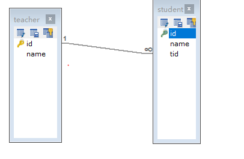

SQL:

```sql
  CREATE TABLE `teacher` (`id` INT(10) NOT NULL,
  `name` VARCHAR(30) DEFAULT NULL,
  PRIMARY KEY (`id`)
) ENGINE=INNODB DEFAULT CHARSET=utf8;

INSERT INTO teacher(id, NAME) VALUES (1, '秦老师');

CREATE TABLE `student` (
  `id` INT(10) NOT NULL,
  `name` VARCHAR(30) DEFAULT NULL,
  `tid` INT(10) DEFAULT NULL,
  PRIMARY KEY (`id`),
  KEY `fktid` (`tid`),
  CONSTRAINT `fktid` FOREIGN KEY (`tid`) REFERENCES `teacher` (`id`)
) ENGINE=INNODB DEFAULT CHARSET=utf8; 
INSERT INTO `student` (`id`, `name`, `tid`) VALUES (1, '小明', 1);
INSERT INTO `student` (`id`, `name`, `tid`) VALUES (2, '小红', 1);
INSERT INTO `student` (`id`, `name`, `tid`) VALUES (3, '小张', 1);
INSERT INTO `student` (`id`, `name`, `tid`) VALUES (4, '小李', 1);
INSERT INTO `student` (`id`, `name`, `tid`) VALUES (5, '小王', 1);
```


## 测试环境

1. 导入Lombok
2. 新建实体类teacher student
3. 建立Mapper接口
4. 新建Mapper.xml文件
5. 在核心配置中绑定Mapper接口或配置文件
6. 测试


## 按照查询嵌套处理

```xml
<mapper namespace="com.zpc.dao.StudentMapper">
<!--    1、查询所有学生的信息-->
<!--    2、根据查出来学生id。寻找对应老师-->

    <select id="getStudent" resultMap="StudentTeacher">
        select * from student;
    </select>

    <resultMap id="StudentTeacher" type="Student">
        <result property="id" column="id" />
        <result property="name" column="name" />
<!--        复杂的属性，需要单独处理-->
<!--        对象：association-->
<!--        集合： collection-->
        <association property="teacher" column="tid" javaType="Teacher" select="getTeacher"/>
    </resultMap>

    <select id="getTeacher" resultType="Teacher">
        select * from teacher where id = #{id};
    </select>
```


## 按照结果嵌套处理

```xml
<!--    按照结果嵌套处理-->
    <select id="getStudent2" resultMap="StudentTeacher2">
        select s.id sid, s.name sname, t.name tname, t.id tid
        from student s, teacher t
        where s.tid = t.id;
    </select>
    
    <resultMap id="StudentTeacher2" type="Student">
        <result property="id" column="sid"/>
        <result property="name" column="sname"/>
        <association property="teacher" javaType="Teacher">
            <result property="name" column="tname"/>
            <result property="id" column="tid"/>
        </association>
    </resultMap>
```


回顾Mysql多对一查询

- 子查询

- 联表查询

# 11、一对多的处理

比如：一个老师拥有多个学生

## 1 环境搭建

实体类

```java
import lombok.Data;

@Data
public class Student {
    private int id;
    private String name;
    private int tid;
}
```

```java
import lombok.Data;

import java.util.List;

@Data
public class Teacher {
    private int id;
    private String name;

    private List<Student> students;
}
```

## 按照结果查询

```xml
<!--    按照结果嵌套查询-->
<select id="getTeacher" resultMap="TeacherStudent">
    select s.id sid, s.name sname, t.name tname, t.id tid
    from student s, teacher t
    where s.tid = t.id and t.id = #{tid};
</select>

<resultMap id="TeacherStudent" type="Teacher">
    <result property="name" column="tname"/>
    <result property="id" column="tid"/>
    <!--        javaType= 指定属性的类型-->
    <!--        集合中的泛型信息，使用ofType获取-->
    <collection property="students" ofType="Student">
        <result property="id" column="sid"/>
        <result property="name" column="sname"/>
        <result property="tid" column="tid"/>
    </collection>
</resultMap>
```


## 按照查询嵌套处理

```xml
<select id="getTeacher2" resultMap="TeacherStudent2">
    select * from teacher where id = #{tid};
</select>

<resultMap id="TeacherStudent2" type="Teacher">
    <collection property="students" javaType="ArrayList" ofType="Student" select="getStudentByTeacherId" column="id"/>
</resultMap>

<select id="getStudentByTeacherId" resultType="Student">
    select *
    from student where tid = #{id};
</select>
```


## 小结

1 关联 association 【多对一】

2 集合 collection    【一对多】

3 javaType & ofType

	1. JavaType  用来指定实体类中属性的类型
 	2. ofType     用来指定映射到List或者集合中的pojo类型，泛型中的约束类型


面试高频

- Mysql引擎
- InnoDB底层原理
- 索引
- 索引优化


# 12、动态SQL

**什么是动态SQL：**

​        **动态SQL就是根据不同的条件生成不同的SQL**

IF

choose

trim

foreach


## 搭建环境

```sql
CREATE TABLE `blog`(
`id` VARCHAR(50) NOT NULL COMMENT 博客id,
`title` VARCHAR(100) NOT NULL COMMENT 博客标题,
`author` VARCHAR(30) NOT NULL COMMENT 博客作者,
`create_time` DATETIME NOT NULL COMMENT 创建时间,
`views` INT(30) NOT NULL COMMENT 浏览量
)ENGINE=INNODB DEFAULT CHARSET=utf8
```


创建一个工程

1. 导包

2. 编写配置文件

3. 编写实体类

   ```java
   import lombok.Data;
   
   import java.util.Date;
   @Data
   public class Blog {
       private int id;
       private String title;
       private String author;
       private Date createTime;
       private int views;
   }
   ```

4. 编写实体类对应的Mapper接口和Mapper.xml文件

   

## IF

```xml
<select id="queryBlogIF" parameterType="map" resultType="Blog">
    select * from blog where 1=1
    <if test="title != null">
        and title = #{title}
    </if>

    <if test="author != null">
        and author = #{author}
    </if>
</select>
```

## choose(when, otherwise)

```xml
<select id="queryBlogChoose" parameterType="map" resultType="Blog">
    select * from blog
    <where>
        <choose>
            <when test="title != null">
                title = #{title}
            </when>
            <when test="author != null">
                and author = #{author}
            </when>
            <otherwise>
                and views = #{views}
            </otherwise>
        </choose>
    </where>
</select>
```


## trim(where, set)

```xml
<select id="queryBlogIF" parameterType="map" resultType="Blog">
    select * from blog
    <where>
        <if test="title != null">
            title = #{title}
        </if>

        <if test="author != null">
            and author = #{author}
        </if>
    </where>
</select>
```

```xml
<update id="updateBlog" parameterType="map">
    update blog
    <set>
        <if test="title != null">
            title = #{title},
        </if>

        <if test="author != null">
            author = #{author}
        </if>

        <if test="views != null">
            views = #{views}
        </if>
    </set>
    where id = #{id}
</update>
```

动态SQL，就是用逻辑语言拼接sql


## Foreach

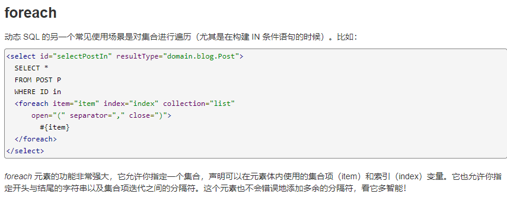


```xml
==>  Preparing: select * from blog WHERE ( id = ? or id = ? or id = ? )
==> Parameters: aa020f64e9634ccc97d59700563f7966(String), 947c2c0238b34d4d8700dfa9f6744d32(String), 1fa76683f02d4b27a4ee27307b985863(String)
```

是用map里一个叫做ids的集合来遍历

遍历的每个结果 再用 open close separator拼接

```xml
<select id="queryBlogForeach" parameterType="map" resultType="Blog">
    select * from blog
    <where>
        <foreach collection="ids" item="id"
                 open="(" close=")" separator="or">
            id = #{id}
        </foreach>
    </where>
</select>
```

Test

```java
@Test
public void queryBlogForeach(){
    SqlSession sqlSession = MybatisUtils.getSqlSession();
    BlogMapper mapper = sqlSession.getMapper(BlogMapper.class);

    HashMap map = new HashMap();
    ArrayList<String> ids = new ArrayList<>();
    ids.add("aa020f64e9634ccc97d59700563f7966");
    ids.add("947c2c0238b34d4d8700dfa9f6744d32");
    ids.add("1fa76683f02d4b27a4ee27307b985863");
    map.put("ids", ids);
    List<Blog> blogList = mapper.queryBlogForeach(map);

    for (Blog blog : blogList) {
        System.out.println(blog);
    }

    sqlSession.close();
}
```


## SQL片段

有的时候，将一些公共SQL片段抽取出来复用。

使用sql标签

```xml
<sql id="if_sql">
    <if test="title != null">
        title = #{title}
    </if>

    <if test="author != null">
        and author = #{author}
    </if>
    <if test="id != null">
        id = #{id}
    </if>
</sql>
```

使用include标签

```xml
<select id="queryBlogIF" parameterType="map" resultType="Blog">
    select * from blog
    <where>
        <include refid="if_sql"></include>
    </where>
</select>
```

建议：

先在Mysql中写入正确的SQL，再修改对应的动态SQL。


# 13、缓存

## 13.1 什么是缓存

查询：连接数据库，消耗资源

一次查询的结果，暂存到可以直接取的地方——>内存：缓存

再次查询的时候直接查缓存


从缓存中查询，提高查询效率，解决了高并发系统性能问题

减少和数据库的交互次数，减少系统开销，提高系统效率

什么样的数据使用缓存？

- 经常查询和不经常改变的数据


## 13.2 Mybatis 缓存

- Mybatis 包含一个非常强大的查询缓存特性，他可以非常方便的定制和配置缓存，缓存可以极大的提高查询效率。

- Mybatis系统中默认定义了两级缓存，一级缓存和二级缓存

  - 默认情况下，只有一级缓存（SqlSession级别的缓存，也称为本地缓存）

  - 二级缓存需要手动开启，基于namespace级别的缓存

  - 为了提高扩展性，Mybatis定义了缓存接口Cache。可以通过实现Cache接口自定义二级缓存


## 13.3 一级缓存

- 一级缓存也叫本地缓存：SqlSession

  - 与数据库同一次会话中查询到的数据会放在本地缓存中。

  - 以后如果需要获取相同的数据，直接从缓存中取，没必要去数据库中取。


测试步骤;

1. 开启日志
2. 测试在一个SqlSession中查询两次相同记录
3. 查看日志输出

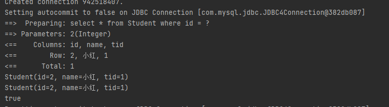

缓存失效的情况：

1. 增删改操作，可能会改变原来的数据，所以必定会刷新缓存
2. 查询不同的东西
3. 查询不同mapper
4. 手动清理缓存

```java
sqlSession.clearCache();
```

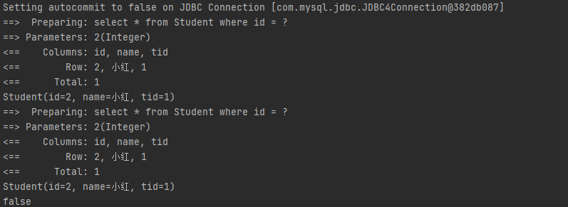

小结：

一级缓存默认开启，只在SqlSession中有效，也就是拿到连接到关闭这个区间

## 13.3 二级缓存

- 二级缓存也称全局缓存

- 基于namespace级别的缓存，一个名称空间，一个二级缓存

- 工作机制

  - 一个会话查询一条数据，这个数据会被放在一级缓存中

  - 如果当前会话关闭了，这个会话对应的一级缓存消失，但是我们想要的是，会话关闭了，一级缓存中的数据会被保存到二级缓存中

  - 新的会话查询信息信息，就可以从二级缓存中获取内容

  - 不同的Mapper查出的数据会放在自己对应的缓存（map）中


步骤：

1. 开启全局

```java
<setting name="cacheEnabled" value="true"/>
```

2. 在要使用二级缓存中的Mapper中开启

   ```xml
   <cache eviction="FIFO"
          flushInterval="60000"
          size="512"
          readOnly="true"/>
   ```

3. 测试

```java 
@Test
public void Test() {
    SqlSession sqlSession1 = MybatisUtils.getSqlSession();
    SqlSession sqlSession2 = MybatisUtils.getSqlSession();
    StudentMapper mapper1 = sqlSession1.getMapper(StudentMapper.class);

    Student student1 = mapper1.queryStudent(2);
    System.out.println(student1);
    sqlSession1.close();   //二级缓存是事务性的，需要先关闭一个session，然后才可以保存到二级缓存

    StudentMapper mapper2 = sqlSession2.getMapper(StudentMapper.class);
    Student student2 = mapper2.queryStudent(2);
    System.out.println(student2);

    System.out.println(student1 == student2);

    sqlSession2.close();

}
```

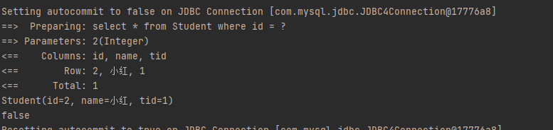

问题：

需要将实体类序列化！否则可能报错

```java
public class Student implements Serializable
```


小结：

- 只要开启二级缓存，在同一个Mapper中就有效
- 所有数据都会先放在一级缓存中
- 只有当会话提交，或者关闭的时候，才会提交到二级缓存中

## 13.5 自定义缓存-ehcache

Ehcache是一种广泛使用的开源Java分布式缓存

先要导包

没搞明白跳过了